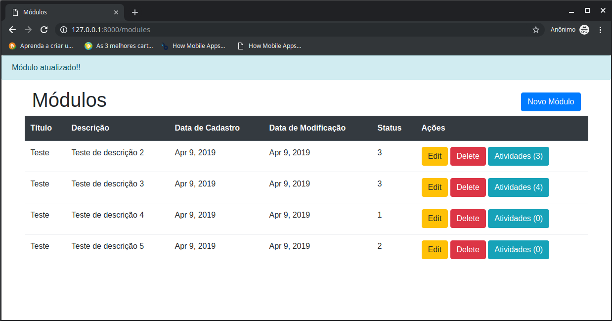
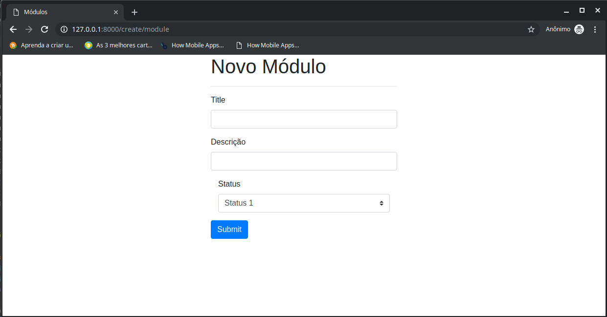
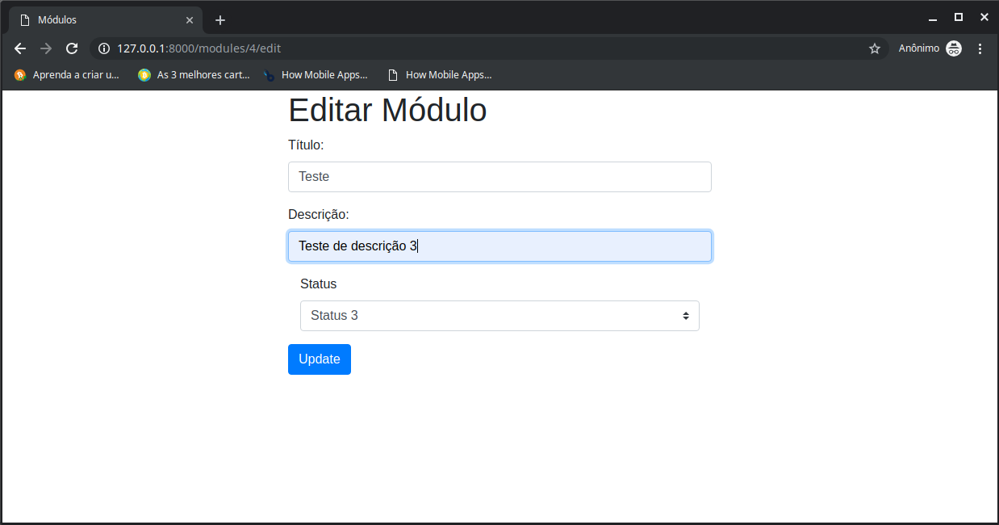
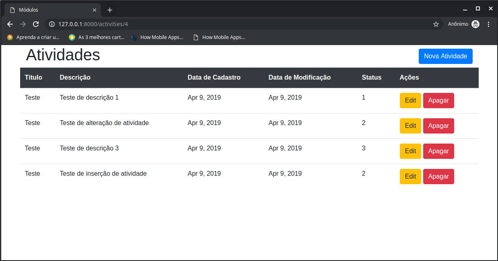
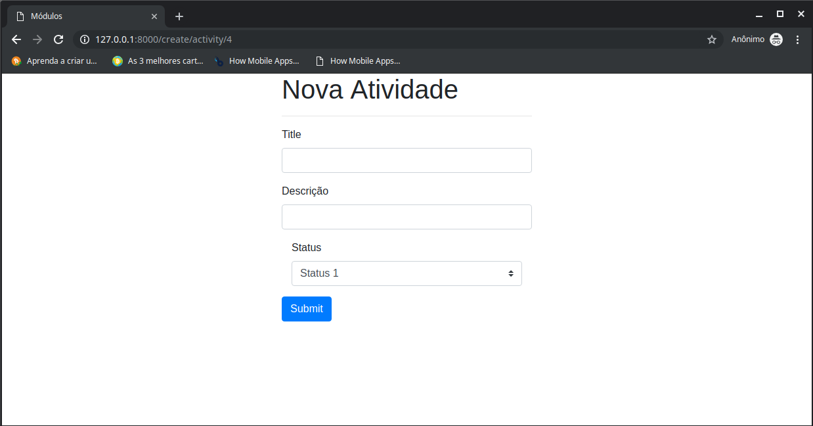
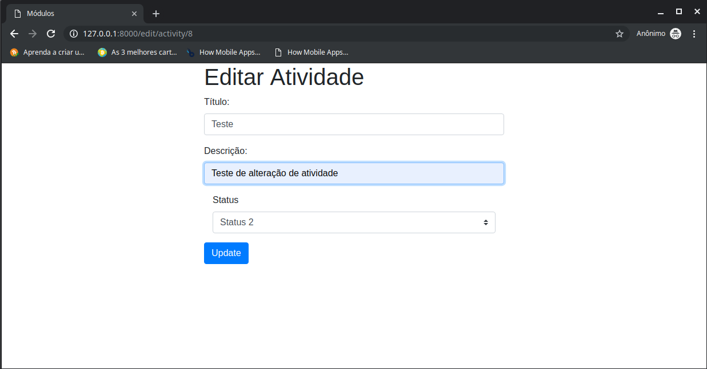

# laravelListing

A listing and sublisting system using laravel framework

Here you'll find three pages where you can get a list and a sublist. Additionally, you can add itens, edit itens and delete any of the items in those lists.

## Minimum Requirements

- PHP 7.3
- Laravel 5.5
- Composer
- MySQL 5.7.25

## Installation

Clone this repository and execute composer update.
```
$ git clone git@github.com:edigar/laravelListing.git
$ cd laravelListing
$ composer update
```

Create the database in your database manager, as below.

```
CREATE DATABASE `list` DEFAULT CHARACTER SET utf8mb4 COLLATE utf8mb4_unicode_ci;
```

An access interface, such as MySQL Workbench, makes it easy to use.

Add the database access data, such as database name, user name, and password in the .env file, which is in the root of the project and execute migration in console.

```
$ php artisan migrate
```
Finally, execute the artisan serve, in the console and access the url of the exit of that command in the browser.

```
$ php artisan serve
Laravel development server started: <http://127.0.0.1:8000>
```

For the above example, just enter the URL http://127.0.0.1:8000 in the browser.

## Screenshots

Below are some pictures of the system.

### Screen modules List



### Screen New Module



### Screen Edit Module



### Screen Activities List



### Screen New Activity 



### Screen Edit Activity

